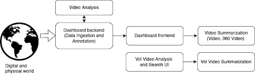

# Overview

A toolbox for media selection and understanding.

## Where does it fit in TRANSMIXR?

## How do I use it?
- Contact info
- Sign-up
- license/cost

## What problems does it solve?

Manage video content (2d, volumetric); 
repurpose content for various production environments; 
analyse content and provide insights;

## How does it work?

The pipeline collects accessible digital content in the form of data items via a Web crawler or the API. Each item is processed in the pipeline in three ways:
Extracting and cleaning raw content from the item;
Extracting or creating technical metadata for the item; and
Determining the descriptive metadata for the item (NLP, NER and NEL components for keyword and entity detection).

